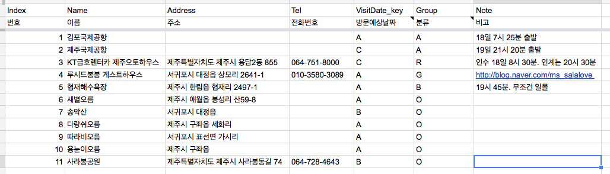

JSON과 dustjs 기반으로 페이지 개발 (프로토타입 버전)
=====

## Step 1

페이지에 장소를 보여줄 때 담겨야 하거나 꼭 필요한 정보들 : 

- 번호, index
- 이름, name
- 주소, address
- 전화번호, tel
- 방문예상날짜, visitDateKey
- 분류, Group
- 비고, Note

## Step 2

정보들을 JSON으로 다시 정의 :
~~~
{
	"index": "", 
	"name": "", 
	"address": "", 
	"tel": "", 
	"visitDateKey": "",
	"group": "", 
	"note": ""
}
~~~

추가 설명 : 

- String 외에는 별도의 데이타타입을 사용하지 않는다.
- 값이 없을 때는 '' 빈값으로 놔둔다. 
- 실제 페이지에 노출되지는 않지만 분기에 사용될 key는 visitDateKey와 group이다. (여기서 분기는 물리적인 마크업구조가 달라지거나 스타일이 다르게 적용될 중요한 기준이 되는 값들이다.)

__visitDateKey :__

- A는 18일
- B는 19일
- C는 18, 19일 모두 
- D는 미정 

__group :__

- A는 공항
- B는 해변
- G는 게스트하우스 (숙소)
- O는 오름
- R은 렌터카 

스키마 : 

~~~
{}
~~~

## Step 3

실제 제주 일정을 소화할 장소들을 구글 스프레드 시트에 정리 : 

## Step 4

완성된 JSON은 renderData.js 파일에 Data를 작성하고 변수이름은 renderData.places에 객체 배열이 담길수 있ㄷ록 한다. 
~~~
var renderData = {
	"places": [
		{}
	]
};
~~~
